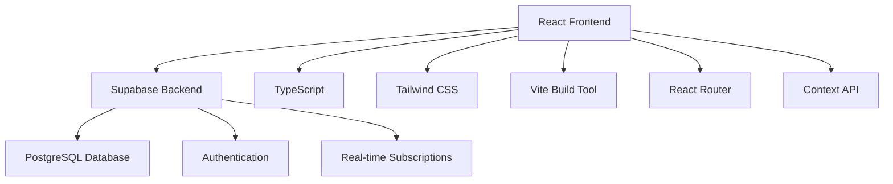
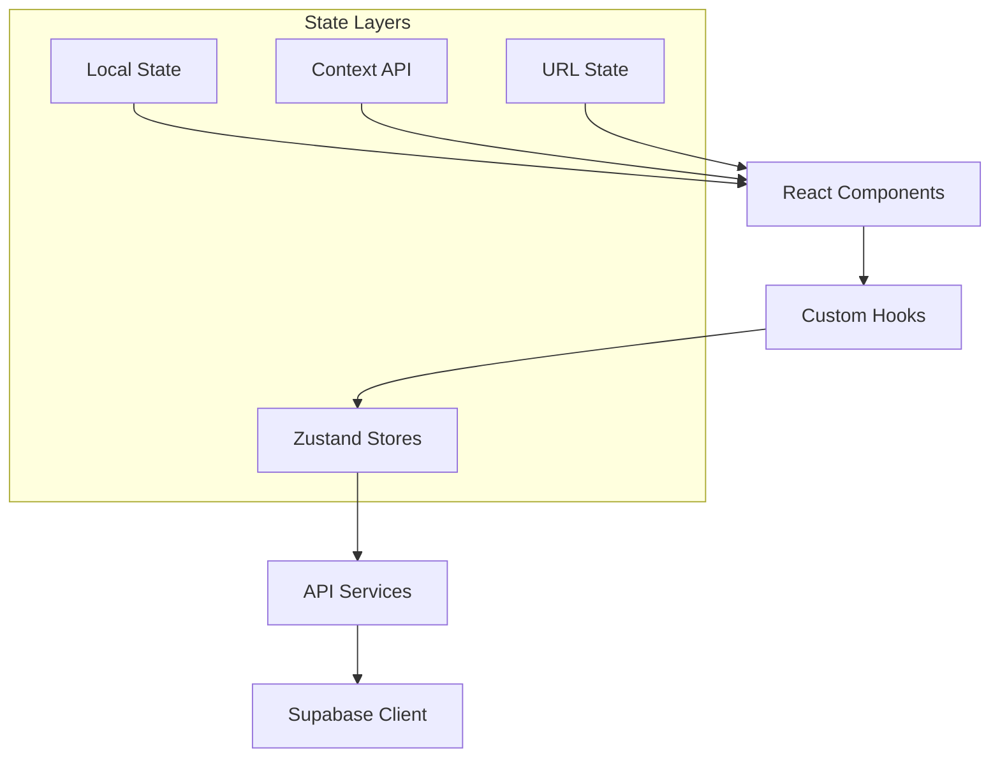
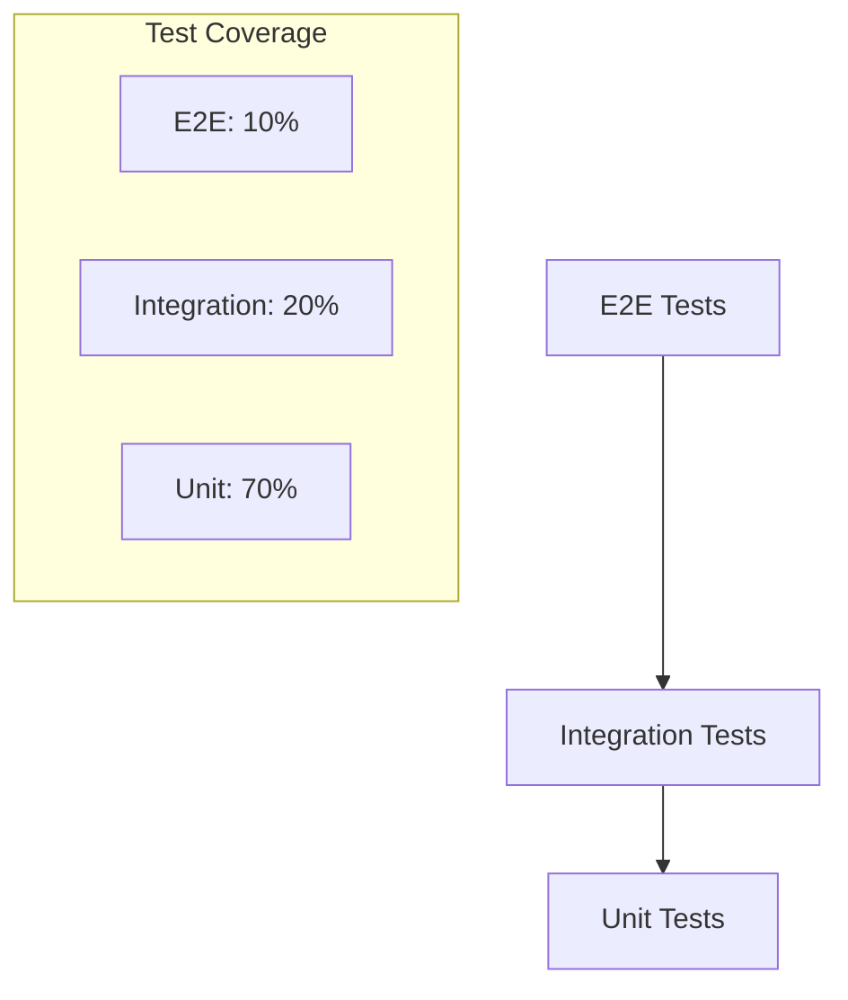

# Kafkasder Projesi - Teknik İyileştirme Mimarisi

## 1. Mevcut Teknik Mimari Analizi

### 1.1 Mevcut Teknoloji Stack'i


### 1.2 Mevcut Klasör Yapısı Analizi

**Güçlü Yönler:**
- Modüler component yapısı
- UI bileşenlerinin ayrı klasörde toplanması
- Services katmanının ayrılması
- TypeScript kullanımı

**Zayıf Yönler:**
- Component'lerin çok büyük olması
- Shared logic'in dağınık olması
- Test dosyalarının eksikliği
- Dokümantasyon yetersizliği

## 2. Önerilen Yeni Teknik Mimari

### 2.1 Geliştirilmiş Klasör Yapısı

```
src/
├── components/
│   ├── ui/                    # Temel UI bileşenleri
│   │   ├── Button/
│   │   │   ├── Button.tsx
│   │   │   ├── Button.test.tsx
│   │   │   ├── Button.stories.tsx
│   │   │   └── index.ts
│   │   ├── Input/
│   │   ├── Modal/
│   │   └── ...
│   ├── forms/                 # Form bileşenleri
│   │   ├── PersonForm/
│   │   ├── DonationForm/
│   │   └── ...
│   ├── layout/                # Layout bileşenleri
│   │   ├── Header/
│   │   ├── Sidebar/
│   │   ├── Footer/
│   │   └── ...
│   └── features/              # Feature-specific bileşenler
│       ├── person-management/
│       ├── donation-management/
│       └── ...
├── hooks/                     # Custom hooks
│   ├── useAuth.ts
│   ├── useApi.ts
│   ├── useLocalStorage.ts
│   └── ...
├── services/                  # API ve external services
│   ├── api/
│   │   ├── persons.ts
│   │   ├── donations.ts
│   │   └── ...
│   ├── auth/
│   └── utils/
├── stores/                    # State management
│   ├── authStore.ts
│   ├── personStore.ts
│   └── ...
├── types/                     # TypeScript type definitions
│   ├── api.ts
│   ├── entities.ts
│   └── ...
├── utils/                     # Utility functions
│   ├── validation.ts
│   ├── formatting.ts
│   ├── constants.ts
│   └── ...
├── styles/                    # Global styles ve themes
│   ├── globals.css
│   ├── themes.ts
│   └── ...
└── __tests__/                 # Test utilities
    ├── setup.ts
    ├── mocks/
    └── utils/
```

### 2.2 State Management Mimarisi



**Önerilen State Management Stratejisi:**
- **Local State**: Component-specific state için useState
- **Shared State**: Zustand store'lar
- **Server State**: React Query/TanStack Query
- **Form State**: React Hook Form
- **URL State**: React Router için

## 3. Component Refactoring Stratejisi

### 3.1 Büyük Component'lerin Bölünmesi

#### Örnek: KisiYonetimi.tsx Refactoring

**Mevcut Yapı (Sorunlu):**
```typescript
// KisiYonetimi.tsx - 800+ satır
function KisiYonetimi() {
  // Çok fazla state
  // Çok fazla useEffect
  // Inline event handlers
  // Karmaşık JSX
}
```

**Önerilen Yeni Yapı:**
```typescript
// features/person-management/PersonManagement.tsx
function PersonManagement() {
  return (
    <PersonManagementProvider>
      <PersonHeader />
      <PersonFilters />
      <PersonTable />
      <PersonModals />
    </PersonManagementProvider>
  )
}

// features/person-management/components/PersonHeader.tsx
function PersonHeader() {
  const { openCreateModal } = usePersonManagement()
  return (
    <PageHeader title="Kişi Yönetimi">
      <Button onClick={openCreateModal}>Yeni Kişi Ekle</Button>
    </PageHeader>
  )
}

// features/person-management/hooks/usePersonManagement.ts
function usePersonManagement() {
  // Centralized logic
}
```

### 3.2 Custom Hook Stratejisi

**API Hooks:**
```typescript
// hooks/api/usePersons.ts
export function usePersons() {
  return useQuery({
    queryKey: ['persons'],
    queryFn: () => personApi.getAll()
  })
}

export function useCreatePerson() {
  const queryClient = useQueryClient()
  return useMutation({
    mutationFn: personApi.create,
    onSuccess: () => {
      queryClient.invalidateQueries(['persons'])
    }
  })
}
```

**Business Logic Hooks:**
```typescript
// hooks/business/usePersonValidation.ts
export function usePersonValidation() {
  const validatePerson = useCallback((person: Person) => {
    // Validation logic
  }, [])
  
  return { validatePerson }
}
```

## 4. UI Component Sistemi

### 4.1 Design Token Sistemi

```typescript
// styles/tokens.ts
export const tokens = {
  colors: {
    primary: {
      50: '#eff6ff',
      100: '#dbeafe',
      500: '#3b82f6',
      600: '#2563eb',
      900: '#1e3a8a'
    },
    semantic: {
      success: '#10b981',
      warning: '#f59e0b',
      error: '#ef4444',
      info: '#3b82f6'
    }
  },
  spacing: {
    xs: '0.25rem',
    sm: '0.5rem',
    md: '1rem',
    lg: '1.5rem',
    xl: '2rem'
  },
  typography: {
    fontSizes: {
      xs: '0.75rem',
      sm: '0.875rem',
      base: '1rem',
      lg: '1.125rem',
      xl: '1.25rem'
    },
    fontWeights: {
      normal: 400,
      medium: 500,
      semibold: 600,
      bold: 700
    }
  }
}
```

### 4.2 Standardize Button Component

```typescript
// components/ui/Button/Button.tsx
interface ButtonProps {
  variant?: 'primary' | 'secondary' | 'success' | 'warning' | 'danger' | 'ghost'
  size?: 'xs' | 'sm' | 'md' | 'lg' | 'xl'
  loading?: boolean
  disabled?: boolean
  icon?: React.ReactNode
  iconPosition?: 'left' | 'right'
  fullWidth?: boolean
  children: React.ReactNode
  onClick?: () => void
}

export function Button({
  variant = 'primary',
  size = 'md',
  loading = false,
  disabled = false,
  icon,
  iconPosition = 'left',
  fullWidth = false,
  children,
  onClick,
  ...props
}: ButtonProps) {
  const baseClasses = 'inline-flex items-center justify-center font-medium rounded-md transition-colors focus:outline-none focus:ring-2 focus:ring-offset-2'
  
  const variantClasses = {
    primary: 'bg-blue-600 text-white hover:bg-blue-700 focus:ring-blue-500',
    secondary: 'bg-gray-200 text-gray-900 hover:bg-gray-300 focus:ring-gray-500',
    // ... diğer varyantlar
  }
  
  const sizeClasses = {
    xs: 'h-6 px-2 text-xs',
    sm: 'h-8 px-3 text-sm',
    md: 'h-10 px-4 text-base',
    lg: 'h-12 px-6 text-lg',
    xl: 'h-14 px-8 text-xl'
  }
  
  return (
    <button
      className={cn(
        baseClasses,
        variantClasses[variant],
        sizeClasses[size],
        fullWidth && 'w-full',
        (disabled || loading) && 'opacity-50 cursor-not-allowed'
      )}
      disabled={disabled || loading}
      onClick={onClick}
      {...props}
    >
      {loading && <Spinner className="mr-2" />}
      {icon && iconPosition === 'left' && <span className="mr-2">{icon}</span>}
      {children}
      {icon && iconPosition === 'right' && <span className="ml-2">{icon}</span>}
    </button>
  )
}
```

### 4.3 İkon Sistemi

```typescript
// components/ui/Icon/Icon.tsx
import { LucideIcon } from 'lucide-react'

interface IconProps {
  icon: LucideIcon
  size?: 'xs' | 'sm' | 'md' | 'lg' | 'xl'
  color?: 'current' | 'primary' | 'secondary' | 'success' | 'warning' | 'error'
  className?: string
}

const sizeMap = {
  xs: 12,
  sm: 16,
  md: 20,
  lg: 24,
  xl: 32
}

const colorMap = {
  current: 'currentColor',
  primary: 'text-blue-600',
  secondary: 'text-gray-600',
  success: 'text-green-600',
  warning: 'text-yellow-600',
  error: 'text-red-600'
}

export function Icon({ icon: IconComponent, size = 'md', color = 'current', className }: IconProps) {
  return (
    <IconComponent
      size={sizeMap[size]}
      className={cn(colorMap[color], className)}
    />
  )
}
```

## 5. Güvenlik İyileştirme Mimarisi

### 5.1 Authentication & Authorization

```typescript
// hooks/useAuth.ts
export function useAuth() {
  const [user, setUser] = useState<User | null>(null)
  const [loading, setLoading] = useState(true)
  
  useEffect(() => {
    const { data: { subscription } } = supabase.auth.onAuthStateChange(
      (event, session) => {
        setUser(session?.user ?? null)
        setLoading(false)
      }
    )
    
    return () => subscription.unsubscribe()
  }, [])
  
  const signIn = async (email: string, password: string) => {
    const { data, error } = await supabase.auth.signInWithPassword({
      email,
      password
    })
    
    if (error) throw error
    return data
  }
  
  const signOut = async () => {
    const { error } = await supabase.auth.signOut()
    if (error) throw error
  }
  
  return {
    user,
    loading,
    signIn,
    signOut,
    isAuthenticated: !!user
  }
}
```

### 5.2 Input Validation & Sanitization

```typescript
// utils/validation.ts
import { z } from 'zod'
import DOMPurify from 'dompurify'

// Schema definitions
export const personSchema = z.object({
  ad: z.string().min(2).max(50),
  soyad: z.string().min(2).max(50),
  email: z.string().email().optional(),
  telefon: z.string().regex(/^[0-9+\-\s()]+$/).optional()
})

// Sanitization functions
export function sanitizeHtml(input: string): string {
  return DOMPurify.sanitize(input)
}

export function sanitizeInput(input: string): string {
  return input.trim().replace(/[<>"'&]/g, '')
}

// Validation hook
export function useValidation<T>(schema: z.ZodSchema<T>) {
  const validate = useCallback((data: unknown): { success: boolean; data?: T; errors?: string[] } => {
    try {
      const result = schema.parse(data)
      return { success: true, data: result }
    } catch (error) {
      if (error instanceof z.ZodError) {
        return {
          success: false,
          errors: error.errors.map(e => e.message)
        }
      }
      return { success: false, errors: ['Validation failed'] }
    }
  }, [schema])
  
  return { validate }
}
```

### 5.3 API Security

```typescript
// services/api/secureApi.ts
class SecureApiClient {
  private baseURL: string
  private token: string | null = null
  
  constructor(baseURL: string) {
    this.baseURL = baseURL
  }
  
  setToken(token: string) {
    this.token = token
  }
  
  private async request<T>(
    endpoint: string,
    options: RequestInit = {}
  ): Promise<T> {
    const url = `${this.baseURL}${endpoint}`
    
    const headers: HeadersInit = {
      'Content-Type': 'application/json',
      ...options.headers
    }
    
    if (this.token) {
      headers.Authorization = `Bearer ${this.token}`
    }
    
    // CSRF token ekleme
    const csrfToken = document.querySelector('meta[name="csrf-token"]')?.getAttribute('content')
    if (csrfToken) {
      headers['X-CSRF-Token'] = csrfToken
    }
    
    const response = await fetch(url, {
      ...options,
      headers
    })
    
    if (!response.ok) {
      throw new Error(`API Error: ${response.status}`)
    }
    
    return response.json()
  }
  
  async get<T>(endpoint: string): Promise<T> {
    return this.request<T>(endpoint, { method: 'GET' })
  }
  
  async post<T>(endpoint: string, data: unknown): Promise<T> {
    return this.request<T>(endpoint, {
      method: 'POST',
      body: JSON.stringify(data)
    })
  }
}
```

## 6. Performance Optimizasyon Stratejisi

### 6.1 Code Splitting

```typescript
// routes/AppRoutes.tsx
import { lazy, Suspense } from 'react'
import { Routes, Route } from 'react-router-dom'
import { LoadingSpinner } from '../components/ui/LoadingSpinner'

// Lazy load components
const Dashboard = lazy(() => import('../pages/Dashboard'))
const PersonManagement = lazy(() => import('../features/person-management'))
const DonationManagement = lazy(() => import('../features/donation-management'))

export function AppRoutes() {
  return (
    <Suspense fallback={<LoadingSpinner />}>
      <Routes>
        <Route path="/" element={<Dashboard />} />
        <Route path="/kisiler" element={<PersonManagement />} />
        <Route path="/bagislar" element={<DonationManagement />} />
      </Routes>
    </Suspense>
  )
}
```

### 6.2 Memoization Strategy

```typescript
// components/PersonTable.tsx
import { memo, useMemo } from 'react'

interface PersonTableProps {
  persons: Person[]
  onEdit: (person: Person) => void
  onDelete: (id: string) => void
}

export const PersonTable = memo(function PersonTable({
  persons,
  onEdit,
  onDelete
}: PersonTableProps) {
  const sortedPersons = useMemo(() => {
    return [...persons].sort((a, b) => a.ad.localeCompare(b.ad))
  }, [persons])
  
  const handleEdit = useCallback((person: Person) => {
    onEdit(person)
  }, [onEdit])
  
  const handleDelete = useCallback((id: string) => {
    onDelete(id)
  }, [onDelete])
  
  return (
    <table>
      {/* Table implementation */}
    </table>
  )
})
```

## 7. Testing Stratejisi

### 7.1 Test Pyramid



### 7.2 Test Utilities

```typescript
// __tests__/utils/testUtils.tsx
import { render, RenderOptions } from '@testing-library/react'
import { QueryClient, QueryClientProvider } from '@tanstack/react-query'
import { BrowserRouter } from 'react-router-dom'

const AllTheProviders = ({ children }: { children: React.ReactNode }) => {
  const queryClient = new QueryClient({
    defaultOptions: {
      queries: { retry: false },
      mutations: { retry: false }
    }
  })
  
  return (
    <QueryClientProvider client={queryClient}>
      <BrowserRouter>
        {children}
      </BrowserRouter>
    </QueryClientProvider>
  )
}

const customRender = (ui: React.ReactElement, options?: RenderOptions) =>
  render(ui, { wrapper: AllTheProviders, ...options })

export * from '@testing-library/react'
export { customRender as render }
```

## 8. Deployment ve CI/CD

### 8.1 Build Optimizasyonu

```typescript
// vite.config.ts
import { defineConfig } from 'vite'
import react from '@vitejs/plugin-react'
import { visualizer } from 'rollup-plugin-visualizer'

export default defineConfig({
  plugins: [
    react(),
    visualizer({
      filename: 'dist/stats.html',
      open: true
    })
  ],
  build: {
    rollupOptions: {
      output: {
        manualChunks: {
          vendor: ['react', 'react-dom'],
          ui: ['@headlessui/react', 'lucide-react'],
          utils: ['date-fns', 'lodash']
        }
      }
    },
    chunkSizeWarningLimit: 1000
  }
})
```

### 8.2 Environment Configuration

```typescript
// config/environment.ts
interface Environment {
  supabaseUrl: string
  supabaseAnonKey: string
  environment: 'development' | 'staging' | 'production'
  apiUrl: string
  enableAnalytics: boolean
}

export const env: Environment = {
  supabaseUrl: import.meta.env.VITE_SUPABASE_URL!,
  supabaseAnonKey: import.meta.env.VITE_SUPABASE_ANON_KEY!,
  environment: (import.meta.env.VITE_ENVIRONMENT as Environment['environment']) || 'development',
  apiUrl: import.meta.env.VITE_API_URL!,
  enableAnalytics: import.meta.env.VITE_ENABLE_ANALYTICS === 'true'
}

// Validation
const requiredEnvVars = ['supabaseUrl', 'supabaseAnonKey', 'apiUrl']
for (const envVar of requiredEnvVars) {
  if (!env[envVar as keyof Environment]) {
    throw new Error(`Missing required environment variable: ${envVar}`)
  }
}
```

## 9. Monitoring ve Analytics

### 9.1 Error Tracking

```typescript
// services/errorTracking.ts
class ErrorTracker {
  static init() {
    window.addEventListener('error', this.handleError)
    window.addEventListener('unhandledrejection', this.handlePromiseRejection)
  }
  
  static handleError(event: ErrorEvent) {
    this.logError({
      message: event.message,
      filename: event.filename,
      lineno: event.lineno,
      colno: event.colno,
      stack: event.error?.stack
    })
  }
  
  static handlePromiseRejection(event: PromiseRejectionEvent) {
    this.logError({
      message: 'Unhandled Promise Rejection',
      reason: event.reason
    })
  }
  
  static logError(error: any) {
    if (env.environment === 'production') {
      // Send to error tracking service
      console.error('Error logged:', error)
    } else {
      console.error('Development Error:', error)
    }
  }
}
```

## 10. Migration Planı

### 10.1 Aşamalı Migration

**Hafta 1-2: Temel Altyapı**
- Design system kurulumu
- Base component'lerin oluşturulması
- Custom hook'ların yazılması

**Hafta 3-4: Kritik Component'ler**
- Dashboard refactoring
- KisiYonetimi refactoring
- Authentication iyileştirmeleri

**Hafta 5-6: Diğer Management Modülleri**
- BagisYonetimi, ProjeYonetimi refactoring
- Form component'lerinin standardizasyonu

**Hafta 7-8: Test ve Optimizasyon**
- Test coverage artırılması
- Performance optimizasyonları
- Security audit

Bu teknik mimari dokümanı, Kafkasder projesinin sistematik iyileştirilmesi için detaylı bir yol haritası sunmaktadır.